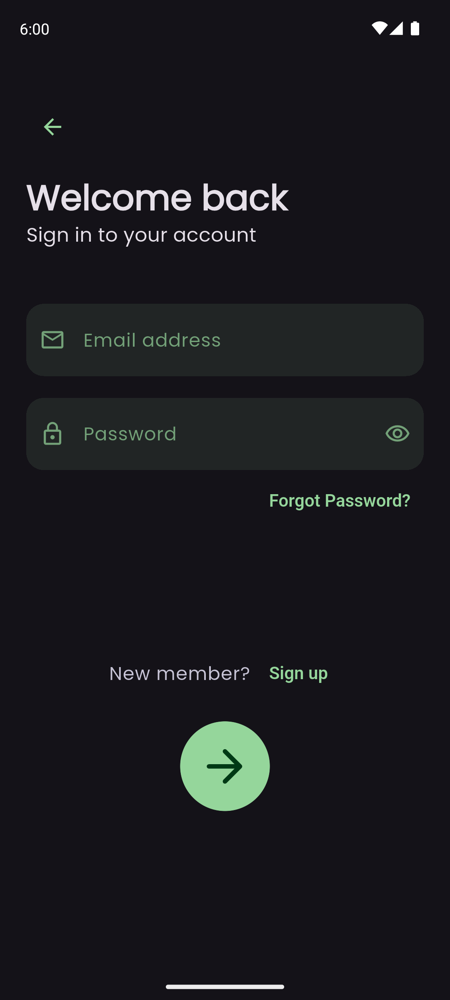
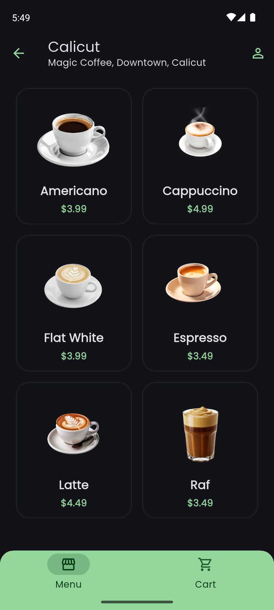
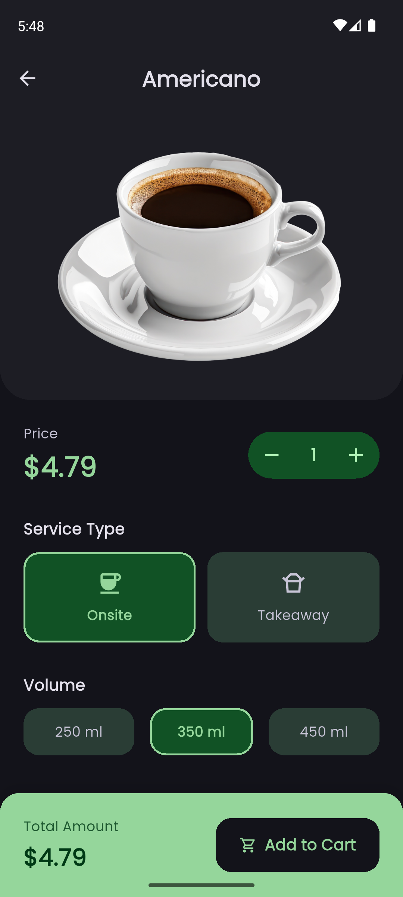
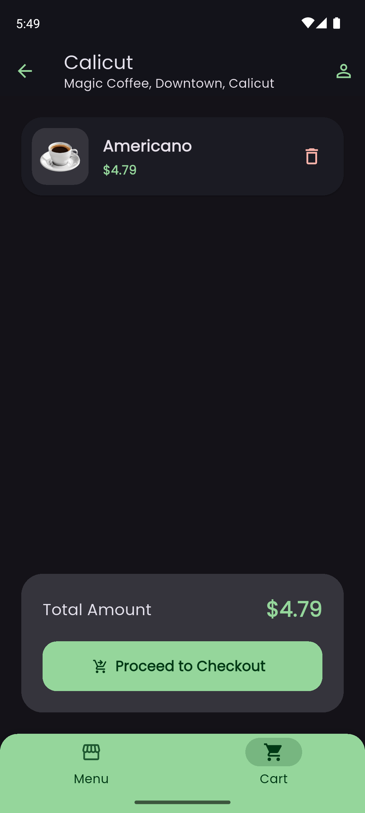
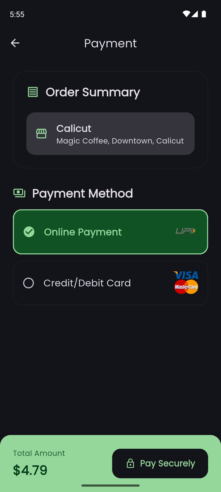
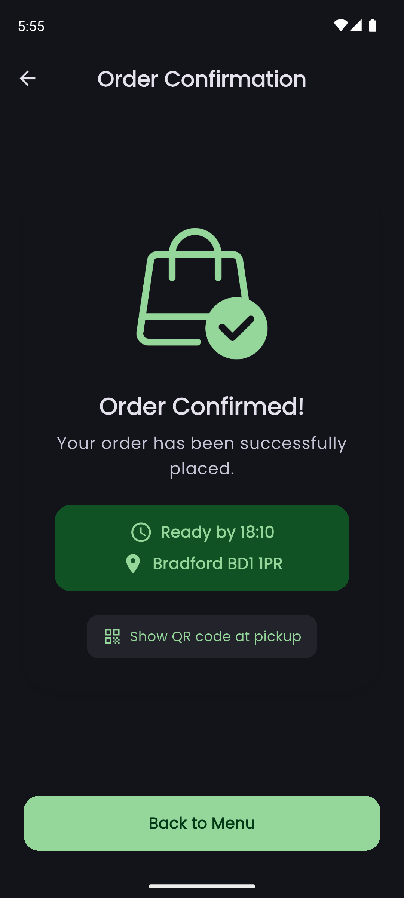
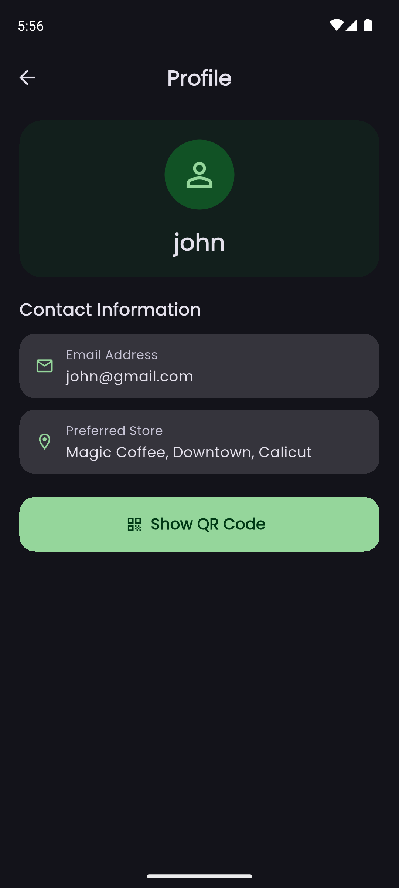
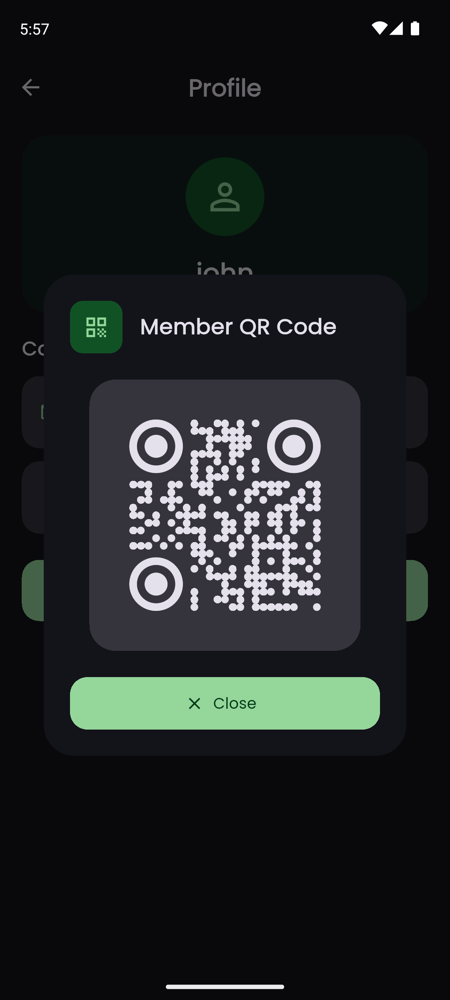

# MCoffee ☕

A polished Flutter coffee-shop ordering app built for portfolio demonstration. Browse nearby Magic Coffee stores, order your favourite drink, and pay — all in a clean Material 3 Expressive UI with full dark/light mode support.

---

## Screenshots

<p align="center">
  
  
  
  
</p>
<p align="center">
  
  
  
  
</p>
<p align="center">
  
  
  
</p>

---

## Features

- **Splash screen** — branded MCoffee logo on a clean dark canvas
- **Welcome screen** — Pacifico wordmark, hero illustration, one-tap entry
- **Auth** — sign in / sign up / forgot password with Firebase Authentication
- **Store map** — OpenStreetMap via `flutter_map`; draggable bottom sheet lists all stores with ratings
- **Menu** — 2-column grid of coffee items with images and prices fetched from Firebase Realtime Database
- **Order options** — choose service type (Onsite / Takeaway) and volume (250 / 350 / 450 ml) with live total
- **Cart** — swipe-to-delete items, live total
- **Payment** — Online Payment (UPI) or Credit/Debit Card selection via Razorpay
- **Order confirmation** — pickup time, store address, member QR code at pickup
- **Profile** — user info from Firestore, member QR code

---

## Tech Stack

| Layer | Technology |
|---|---|
| Framework | Flutter 3 · Dart `^3.7.2` |
| UI | Material 3 Expressive (`DynamicSchemeVariant.expressive`) |
| Theming | System dark/light mode (`ThemeMode.system`) |
| Fonts | Poppins (Google Fonts) · Pacifico (asset) |
| Auth | Firebase Authentication |
| Database | Firebase Realtime Database |
| User data | Cloud Firestore |
| Maps | flutter\_map + OpenStreetMap tiles |
| Payments | Razorpay Flutter |
| QR Code | qr\_flutter |
| Icons | Android adaptive icon (all densities, API 21+) |

---

## Getting Started

### Prerequisites

- Flutter SDK `>=3.7.2`
- Android SDK (API 21+) or Xcode 14+
- A Firebase project with **Authentication**, **Realtime Database**, and **Firestore** enabled

### Setup

```bash
git clone https://github.com/sayedalmarwan/mcoffee.git
cd mcoffee
flutter pub get
```

Add your `google-services.json` to `android/app/` and `GoogleService-Info.plist` to `ios/Runner/` from the Firebase console, then:

```bash
flutter run
```

### Demo credentials

| Field | Value |
|---|---|
| Email | john@gmail.com |
| Password | john1234 |

---

## Project structure

```
lib/
├── main.dart            # App entry, routes, ThemeMode.system
├── theme.dart           # Material 3 Expressive light + dark themes
├── coffee_field.dart    # Shared CoffeeField text input widget
├── startup_screen.dart  # Splash / logo screen
├── welcome.dart         # Landing / hero page
├── signin.dart          # Firebase sign-in
├── signup.dart          # Firebase sign-up
├── forgot_password.dart # Password reset email
├── cafe.dart            # Store map + draggable bottom sheet
├── menu.dart            # Menu grid + cart tab (NavigationBar)
├── order_options.dart   # Item customisation (size, type, qty)
├── order_payment.dart   # Payment method + Razorpay
├── confirmed_page.dart  # Order confirmation + QR pickup code
└── profile.dart         # User profile + member QR code
```

---

## Download

Get the latest release APK from the [Releases](https://github.com/sayedalmarwan/mcoffee/releases) page.

---

## License

MIT
